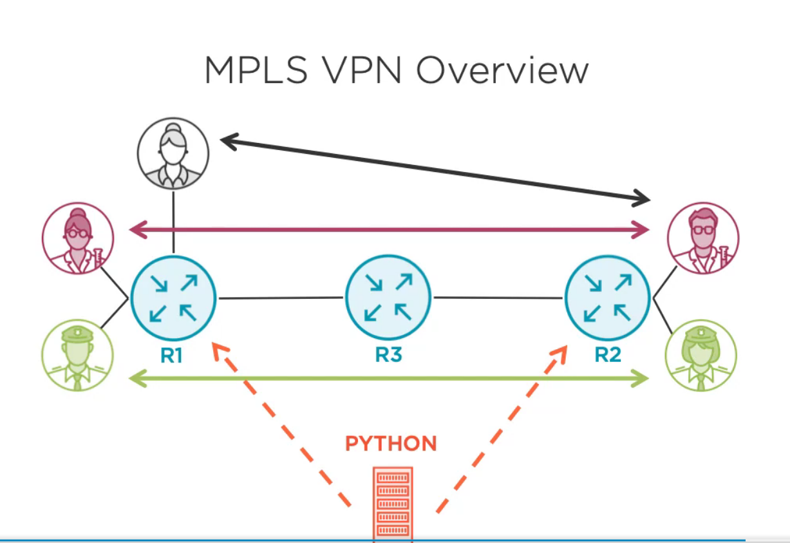

# python-adv  
Practice adv python concepts and coolness
&nbsp;  
&nbsp;  

### Env setup  
pip3 install -r requirements.txt  
code .&  
&nbsp;  
&nbsp;  

## projects:  
&nbsp;  
### resolver/  
Implementation of __call__() in order to create a "cache" or stateful inheretance of a class.  
&nbsp;  
&nbsp;  

### reader/  
Simple example of passing around fns as 1st class citizens
&nbsp;  
&nbsp;  

### impl_collections/  
Implelemtation of a 'SortedSet' class.  
This is a custom collection version of the 'set' class which supports container, sized, iterable,  
and sequence collection protocols. TODO: toss in simple ability to reverse the set.
&nbsp;  
This follows a simple TDD scenario: Test->Code->Design(refactor)->Test...  using unittest.
&nbsp;  
&nbsp;  

### flow_control_adv/  
### byte_oriented_prg/  
### obj_internals/  
### descriptors/  
### instance_create/  
### metaclasses/  
### class_decorators/  
### abstract_base_classes/  
&nbsp;  
&nbsp;  
### python_networking  
Python networking config of a MPLS_VPN as seen in image below.  

